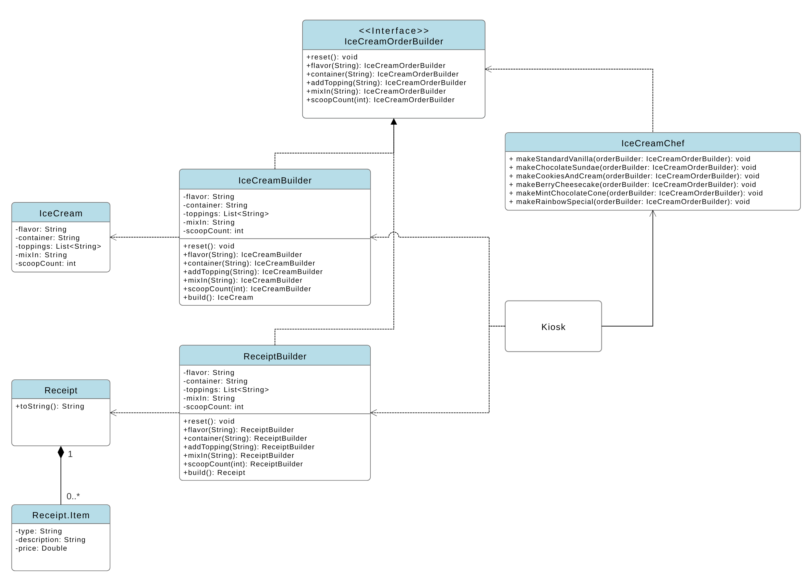

# Ice Cream Order System - Builder Design Pattern

An implementation of the **Gang of Four (GoF) Creational Builder Pattern** simulating an interactive ice cream shop ordering system.

The system decouples the assembly steps of an ice cream order from its final representations, allowing the same construction process orchestrated by an `IceCreamChef` (Director) to produce two completely different products:
1. **`IceCream`**: The physical dessert object containing flavor, toppings, container type, and scoop counts.
2. **`Receipt`**: An itemized, financial billing document calculating costs and formatted for customer presentation.

---

## 1. Architecture & Technical Components

| Component | Class / Interface | Responsibility |
| :--- | :--- | :--- |
| **Product A** | `IceCream` | Immutable domain model representing the physical assembled dessert. |
| **Product B** | `Receipt` | Immutable financial model holding line items (`Receipt.Item`) and total calculation. |
| **Builder Interface** | `IceCreamOrderBuilder` | Declares all step-by-step assembly operations common to any order representation. |
| **Concrete Builder A** | `IceCreamBuilder` | Assembles properties into a finalized `IceCream` object. |
| **Concrete Builder B** | `ReceiptBuilder` | Translates assembly steps into priced `Receipt.Item`s and computes a `Receipt`. |
| **Director** | `IceCreamChef` | Defines reusable recipe presets (`makeBerryCheesecake`, `makeChocolateSundae`, etc.). |
| **Client** | `Kiosk` | Entry point (`main`) orchestrating the chef and builders to produce outputs. |

---

## 2. UML Class Diagram

The system structure follows the classic GoF Builder Pattern:
* `IceCreamChef` depends on `IceCreamOrderBuilder`.
* `IceCreamBuilder` and `ReceiptBuilder` realize `IceCreamOrderBuilder`.
* Concrete builders construct and depend on their respective products.
* `Receipt` has a composition relationship with its inner record `Receipt.Item`.



---

## 3. Clean Code Requirements

Below are six Clean Code principles taken directly from **Chapter 2 (*Meaningful Names*)** and **Chapter 3 (*Functions*)** of Robert C. Martin's *Clean Code*, with justifications and before/after code excerpts from my implementation.

---

### 1. Make Meaningful Distinctions (Clean Code, Chapter 2)
> *"Noise words are another type of meaningless distinction. Imagine you have a Product class. If you have another called ProductInfo or ProductData, you have made the names different without making them mean anything different."* — Robert C. Martin

* **Justification:** In my initial design, the concrete builder was named `IceCreamProductBuilder` alongside `IceCream`. The word `Product` was a textbook noise word: `IceCream` was already the product being built. Furthermore, having `IceCreamBuilder` as the interface and `IceCreamProductBuilder` as the concrete class made it impossible to guess their distinct responsibilities without reading the source code.
* **Refactoring:** I eliminated the noise word `Product` from the concrete builder and renamed the interface to `IceCreamOrderBuilder`, making a clear, meaningful distinction: the interface defines the steps of an *order*, while `IceCreamBuilder` builds the concrete *dessert*.

```java
// BEFORE (Noise word "Product" and confusing distinction):
public interface IceCreamBuilder { ... }
public class IceCreamProductBuilder implements IceCreamBuilder { ... }

// AFTER (Meaningful distinction: Order vs. Concrete Builder):
public interface IceCreamOrderBuilder { ... }
public class IceCreamBuilder implements IceCreamOrderBuilder { ... }
```

---

### 2. Flag Arguments (Clean Code, Chapter 3)
> *"Flag arguments are ugly. Passing a boolean into a function is a truly terrible practice. It immediately complicates the signature of the method, loudly proclaiming that this function does more than one thing."* — Robert C. Martin

* **Justification:** My first builder implementation used boolean setters like `setCherry(boolean hasCherry)` and `setSprinkles(boolean hasSprinkles)`. Passing boolean flags forced methods to handle two distinct paths (adding or not adding) and violated the Open/Closed Principle: every new topping in the shop would require adding another boolean method and field.
* **Refactoring:** I replaced flag arguments with a single, monadic `addTopping(String topping)` method backed by a `List<String>`.

```java
// BEFORE (Flag arguments proclaim the method does multiple things):
public IceCreamBuilder setCherry(boolean hasCherry) {
  this.hasCherry = hasCherry;
  return this;
}

public IceCreamBuilder setSprinkles(boolean hasSprinkles) {
  this.hasSprinkles = hasSprinkles;
  return this;
}

// AFTER (Monadic method without boolean flags; highly extensible):
@Override
public IceCreamBuilder addTopping(String topping) {
  this.toppings.add(topping);
  return this;
}
```

---

### 3. Have No Side Effects (Clean Code, Chapter 3)
> *"Side effects are lies. Your function promises to do one thing, but it also does other hidden things... It often results in strange temporal couplings and order dependencies."* — Robert C. Martin

* **Justification:** In my early implementation, calling `build()` instantiated the object and then immediately called `reset()`. The method name `build()` promised to construct and return a product, but secretly wiped the builder's internal state. This hidden side effect created unexpected bugs if a client wanted to create an ice cream, add one extra topping, and build a second variation.
* **Refactoring:** I removed `reset()` from inside `build()`. `build()` is now a pure query that constructs the object without mutating the builder's state, while `reset()` is an explicit command called deliberately (e.g., by the `IceCreamChef` before preparing a recipe).

```java
// BEFORE (Hidden side effect silently wipes builder state during build):
@Override
public IceCream build() {
  IceCream iceCream = new IceCream(flavor, container, syrupType, scoopCount, hasCherry, hasSprinkles);
  reset(); // <-- Hidden side effect!
  return iceCream;
}

// AFTER (Idempotent construction without unexpected side effects):
public IceCream build() {
  return new IceCream(flavor, container, toppings, mixIn, scoopCount);
}
```

---

### 4. Output Arguments (Clean Code, Chapter 3)
> *"Arguments are most naturally interpreted as inputs to a function... When we read a function, we are accustomed to the idea of information going in via the arguments and out through the return value. Anything that forces you to check the function signature is equivalent to a double-take."* — Robert C. Martin

* **Justification:** When first refactoring `ReceiptBuilder.build()`, I extracted 5 helper methods that all accepted `List<Receipt.Item> items` and mutated it (e.g., `addFlavorIfExist(items)`). This used `items` as an *output argument*, forcing a reader to inspect method signatures to determine which methods modified the list.
* **Refactoring:** I removed the output arguments. Instead of passing a collection around to be mutated across 5 helper methods, I kept `build()` linear and self-contained, where `items` is populated directly in a clear, top-to-bottom flow.

```java
// BEFORE (Output argument smell - mutating a passed-in list):
public Receipt build() {
  List<Receipt.Item> items = new ArrayList<>();
  addFlavorIfExist(items);   // Mutates items as an output argument!
  addContainerIfExist(items); // Mutates items as an output argument!
  return new Receipt(items);
}

private void addFlavorIfExist(List<Receipt.Item> items) {
  if (flavor != null) {
    items.add(new Receipt.Item("Flavor: ", flavor, 2.99));
  }
}

// AFTER (Linear flow with no output arguments):
public Receipt build() {
  List<Receipt.Item> items = new ArrayList<>();

  if (flavor != null) {
    items.add(new Receipt.Item("Flavor: ", flavor, BASE_FLAVOR_PRICE));
  }
  if (container != null) {
    items.add(new Receipt.Item("Container: ", container, CONTAINER_PRICE));
  }
  for (String topping : toppings) {
    items.add(new Receipt.Item("Topping: ", topping, TOPPING_PRICE));
  }
  return new Receipt(items);
}
```

---

### 5. Argument Objects (Clean Code, Chapter 3)
> *"When a function seems to need more than two or three arguments, it is likely that some of those arguments ought to be wrapped into a class of their own."* — Robert C. Martin

* **Justification:** In an early version of `Receipt`, I tracked items using two parallel lists: `List<String> items` and `List<Double> prices`, coupled only by array index. Passing names and prices separately treated them as loosely connected primitives rather than a unified concept, risking index misalignment bugs.
* **Refactoring:** I wrapped the description, value, and price into an argument/value object: `Receipt.Item`. This turned parallel primitive collections into a single, cohesive collection.

```java
// BEFORE (Parallel primitive lists coupled only by index):
public class Receipt {
  private final List<String> items = new ArrayList<>();
  private final List<Double> prices = new ArrayList<>();

  public void addItem(String item, double price) {
    items.add(item);
    prices.add(price);
  }
}

// AFTER (Cohesive Argument/Value Object encapsulates the concept):
public class Receipt {
  public record Item(String type, String description, Double price) {}
  private final List<Item> items; // Single list of cohesive objects
}
```

---

### 6. Use Solution and Problem Domain Names (Clean Code, Chapter 2)
> *"Remember that the people who read your code will be programmers. So go ahead and use computer science terms, algorithm names, pattern names, math names, and so on... When there is no 'programmer-ese' for what you're doing, use the name from the problem domain."* — Robert C. Martin

* **Justification:** Clean Code recommends using solution-domain pattern suffixes (`Builder`) so developers immediately recognize the architectural role of a class. At the same time, domain concepts should use problem-domain vocabulary (*Ubiquitous Language*) rather than generic textbook jargon like `Director` or `Client`.
* **Refactoring:** I kept the solution-domain suffix `*Builder` for construction classes, but renamed textbook placeholders to domain-aligned names from the ice cream problem space:
  * Generic `Director` ➔ `IceCreamChef`
  * Generic `Client` ➔ `Kiosk`

```java
// BEFORE (Generic textbook jargon):
IceCreamDirector director = new IceCreamDirector();
// in Client.java

// AFTER (Solution domain pattern + Problem domain Ubiquitous Language):
IceCreamChef chef = new IceCreamChef();
IceCreamBuilder iceCreamBuilder = new IceCreamBuilder();
// in Kiosk.java
```

## 4. How to Compile & Run

### Prerequisites
* Java JDK 17 or higher

### Compile
From the root project directory:
```bash
javac -d out src/builder/*.java
```

### Run
```bash
java -cp out builder.Kiosk
```

### Sample Output
```text
IceCream{flavor='Cotton Candy', container='Cup', toppings=[Rainbow Sprinkles, Gummy Bears], mixIn='Marshmallows', scoopCount=1}

===================== RECEIPT =====================
Flavor:        Cotton Candy               $    2.99
Container:     Cup                        $    0.99
Topping:       Rainbow Sprinkles          $    1.49
Topping:       Gummy Bears                $    1.49
Mix-In:        Marshmallows               $    1.49
===================================================
TOTAL                                     $    8.45
```